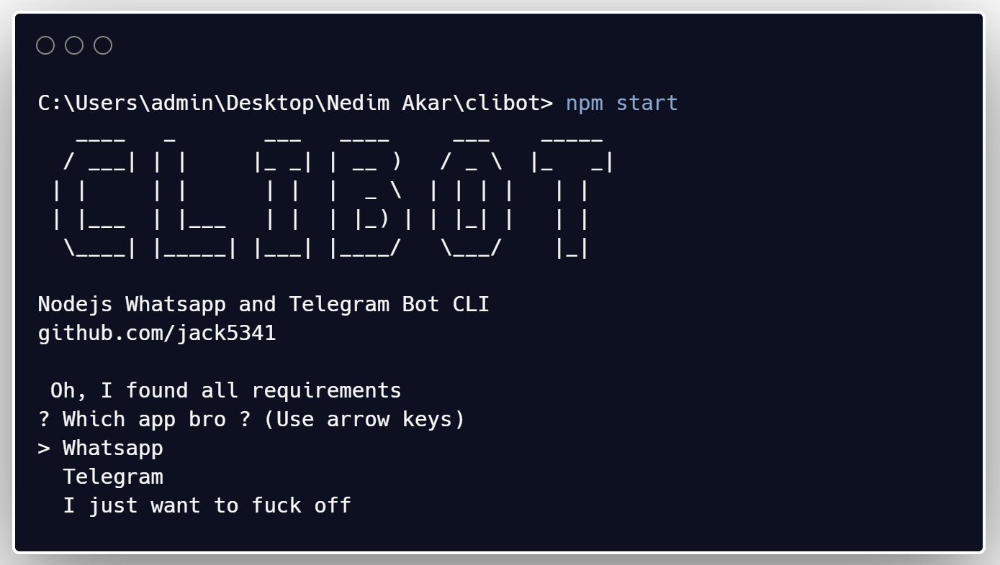
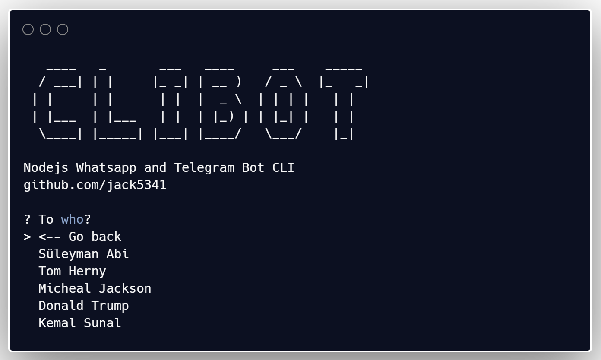

> # Still in under development 🚧

<p>
  <a href="#" target="_blank">
    
  </a>
   <a href="https://twitter.com/0jack5341" target="_blank">
    
  </a>
    

</p>

|   	|   	|
|---	|---	|
  |   


# Clibot-wp-tg
This is a simple **CLIBOT** for Whatsapp and Telegram. Developing by Telegram API and Whatsapp third pary APIs. How cool ! 😎 after installation you will be able to send from the terminal

## Installation

Use the packager manager npm to install clibot. 

```sh
$ npm install -g . && clibot 
```

## Requirements
Requirements for run correctly bot.
* API Key (Telegram)
* API Key (Whatsapp)
* Your phone and PC should be connected to internet

## Author
👤 **jack5341**
* Website: https://jack5341.github.io/
* Twitter: https://twitter.com/0jack5341
* Github: https://github.com/jack5341


## Contributing
Pull requests are welcome. For major changes, please open an issue first to discuss what you would like to change.

> Whatsapp is still in under construction 🚧

## Show your support

Give a ⭐️ if this project helped you! or buy me a 🍺
<a href="https://www.paypal.com/paypalme/nedimakar5341">Paypal</a>

## License
[MIT](https://choosealicense.com/licenses/mit/)